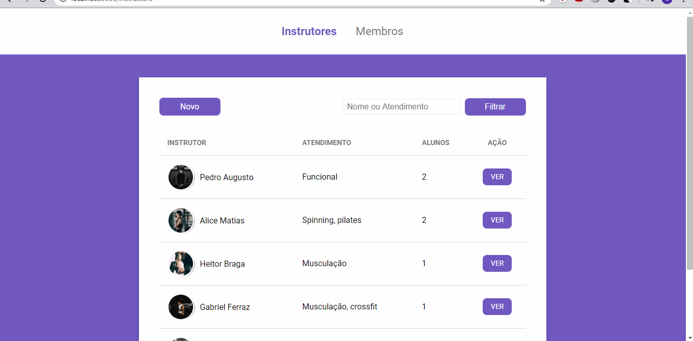

# Gym Manager

Web App and to manage instructors and members of an academy

### Prerequisites

You'll need to install <a href="https://nodejs.org/en/">node.js.<a>

## Running front-end

The frontend consists on two pages, one for the instructors and other for the members, where its possible to checkout their data, edit or delet them.

    

* Step 1 - On your cmd, access the gym-manager project folder.
* Step 2 - Run npm install.
* Step 3 - Run npm start.
